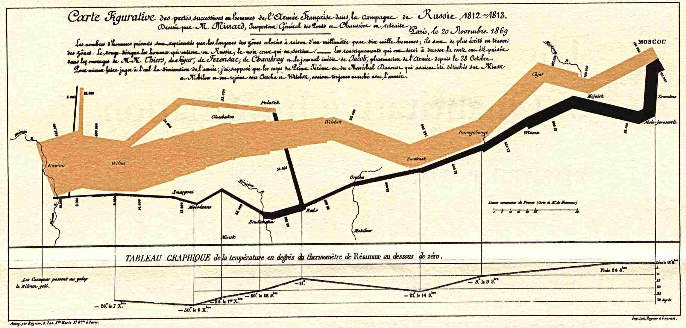
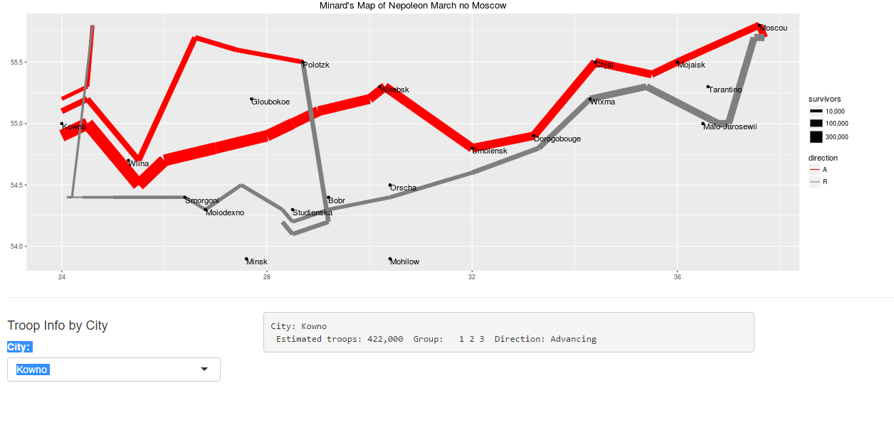

Course Project: Minard's Graphic Depiction on the Napoleon's March on Moscow.
========================================================
author: Pee Chih Yang
date: 27/3/2016
autosize: true

Introduction
========================================================
- "Figurative Map of the successive losses in men of the French Army in the Russian campaign 1812-1813" was drawn by Mr. Minard, Inspector General of Bridges and Roads in retirement. Paris, 20 November 1869.

- The numbers of men present are represented by the widths of the colored zones. Red designates men moving into Russia, gray those on retreat.

The Original Graphic Depiction
=======================================================
- The original graphic depiction is as follows

The Project
=======================================================
- In this project, the graphic depiction is reproduced using R code example provided in dataset "Minard".

- Several information such the tempreture, days of  retreat, date, are ommitted in this project.

- A function that returns information about the numbers of troops near to or at specific cities and their movement is created in this project.

- User may select the city from select list input control. Information such as the troop numbers, and their direction will be provided in the program.

The User Interface
========================================================

